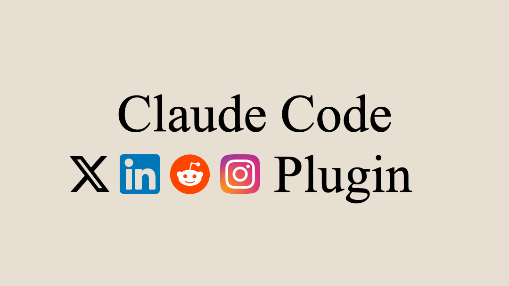

<p align="center">
  
</p>

<h1 align="center">Socials</h1>

<p align="center">
  <strong>Give Claude superpowers on X, LinkedIn, and Reddit.</strong>
</p>

---

## Install

1. Install the [Socials Chrome extension](https://chromewebstore.google.com/detail/socials-generate-posts-in/pmpemhbbmaicdmnlmenopaclpdfnllje)

2. In the Terminal or Preferred IDE Terminal:

```
claude
```

2. In Claude Code:

```
/plugin marketplace add Brainrot-Creations/claude-plugins
```

```
/plugin install socials@brainrot-creations
```

```
/reload-plugins
```

Done. Talk to Claude naturally:

- _"Connect with 100 LinkedIn recruiters hiring for React roles"_
- _"Find Reddit threads about note-taking and mention my app naturally"_
- _"Reply to 50 X posts about indie hacking and promote my SaaS"_

---

## Troubleshooting

- **Port 9847 in use** — Kill stale node processes or set `SOCIALS_MCP_RECLAIM_PORT=1`
- **Extension not connecting** — Open the Socials side panel, then reload
- **Tools not working** — Make sure you're signed into Socials

---

[MIT License](./LICENSE) · [Security](./SECURITY.md) · [contact@brainrotcreations.com](mailto:contact@brainrotcreations.com)
